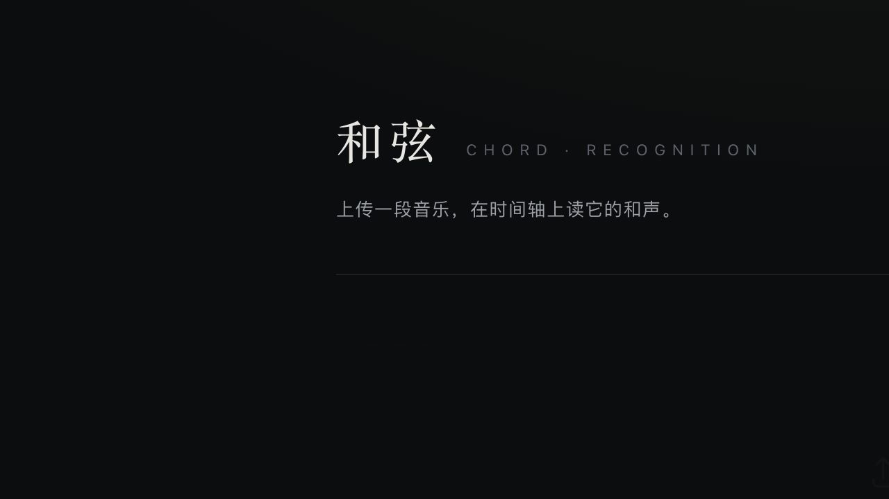
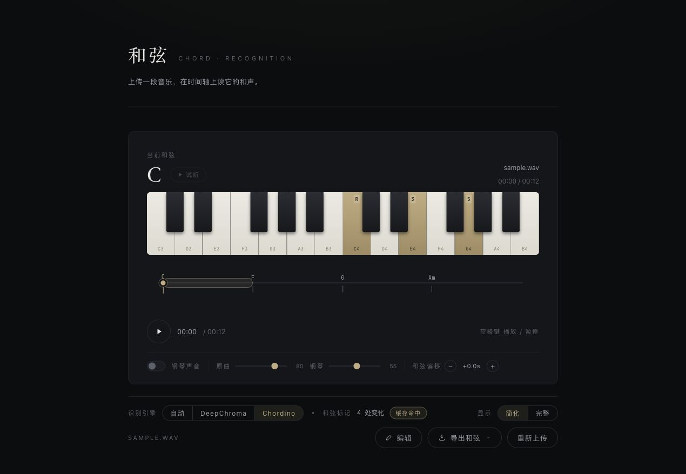

# Chord Deck

[](https://www.python.org/)
[](https://fastapi.tiangolo.com/)
[](https://vuejs.org/)
[](https://openai.com/codex/)
[](https://chatgpt.com/)

上传一段音乐，自动识别和弦，在播放器时间轴上阅读和声进行，并在需要时手动校正结果。

Upload a piece of music, recognize its chords, inspect the progression on a player timeline, and correct the result when needed.

[中文](#中文) · [English](#english)

## 界面预览 / Screenshots

### 首页 / Upload



### 识别结果 / Analysis result



## 中文

### 项目简介

Chord Deck 是一个本地优先的音频和弦识别与编辑工具。音频、识别结果和历史记录都保存在本机，不依赖第三方上传服务。

### 功能

- 支持 WAV、MP3、OGG、FLAC、M4A、AAC、WebM、Opus、AIFF。
- DeepChroma、Chordino 和 librosa 模板匹配三段式默认回退链路，并提供独立环境中的 LV-Chordia 可选引擎。
- MD5 + 引擎缓存，重复分析可直接复用结果。
- 长音频后台分析，前端显示排队、提取和保存阶段进度。
- 播放器时间轴、悬停和弦标记、点击跳转、空格播放/暂停。
- 完整和弦/简化和弦双档展示与导出。
- DAW 风格编辑工作台：移动、缩放、吸附、分割、删除、改名和保存。
- BPM、节拍网格、转位和弦解析、钢琴键盘高亮与钢琴试听。
- 历史记录、重新识别、删除缓存音频。

### 技术栈

| 层 | 技术 |
| --- | --- |
| 前端 | Vue 3 + Vite + 原生 Web Audio API |
| 后端 | Python + FastAPI + Uvicorn |
| 识别 | DeepChroma / Chordino NNLS-Chroma / librosa 模板匹配 / 可选 LV-Chordia |
| 持久化 | SQLite + 本地音频资源目录 |
| 包管理 | uv（Python）和 npm（前端） |

### 快速开始

#### 一键启动

项目已包含环境检查和启动脚本：

```bash
./start.sh
```

脚本会检查 Python 模块、VAMP 插件、DeepChroma 模型缓存、npm、前端依赖和生产构建，然后启动：

- 前端：http://127.0.0.1:5173
- 后端：http://127.0.0.1:8000

#### 手动启动

后端：

```bash
uv sync --managed-python
uv run uvicorn backend.main:app --reload --port 8000
```

前端：

```bash
cd frontend
npm install
npm run dev
```

如果本机已存在项目虚拟环境，也可以直接使用：

```bash
./.venv/bin/python scripts/check_env.py
./.venv/bin/uvicorn backend.main:app --reload --port 8000
```

#### 生产模式

```bash
cd frontend && npm run build
cd .. && uv run uvicorn backend.main:app --port 8000
```

然后访问 http://127.0.0.1:8000。FastAPI 会同时托管 API 和 `frontend/dist`。

### 环境检查

只检查环境，不启动服务：

```bash
./.venv/bin/python scripts/check_env.py
```

VAMP 插件和 DeepChroma 模型缓存属于可选能力。缺失时脚本会显示警告，后端仍会使用可用的回退引擎。

### 异步分析与配置

短音频保持同步响应。默认超过 30 秒的音频会返回 HTTP 202：

```json
{
  "task_id": "a1b2c3d4e5f6",
  "status": "queued",
  "progress": 0,
  "stage": "queued"
}
```

前端会轮询 `GET /api/tasks/{task_id}`。任务完成后，响应中的 `result` 与同步分析结果格式一致。

可用环境变量调整行为：

| 变量 | 默认值 | 说明 |
| --- | ---: | --- |
| `CHORD_MAX_UPLOAD_MB` | `200` | 单个上传文件大小上限 |
| `CHORD_ASYNC_DURATION_SECONDS` | `30` | 进入后台任务的音频时长阈值 |
| `CHORD_ANALYZE_WORKERS` | `2` | 当前进程的后台分析线程数 |

### API

| 方法 | 路径 | 说明 |
| --- | --- | --- |
| `POST` | `/api/analyze` | 上传音频并分析；长音频返回任务 ID |
| `GET` | `/api/tasks/{task_id}` | 查询后台任务状态和进度 |
| `GET` | `/api/analyses/{id}` | 读取历史分析结果 |
| `POST` | `/api/analyses/{id}/reanalyze?engine=` | 使用指定引擎重新识别 |
| `PUT` | `/api/analyses/{id}/chords` | 保存人工编辑后的和弦序列 |
| `DELETE` | `/api/analyses/{id}` | 删除历史记录及无引用的音频缓存 |
| `GET` | `/api/history` | 获取历史记录 |
| `GET` | `/api/audio/{name}` | 获取本地托管音频 |
| `GET` | `/api/analyses/{id}/beats` | 获取或计算节拍网格 |
| `GET` | `/api/health` | 健康检查 |

`engine` 支持 `auto`（默认）、`deepchroma`、`chordino` 和 `lv-chordia`。`auto` 仍按 DeepChroma → Chordino → librosa 模板匹配顺序回退，不会自动切换到 LV-Chordia。

LV-Chordia 需要单独安装 `.venv-lv`，后端通过实验适配器子进程调用；可用 `CHORD_LV_PYTHON`、`CHORD_LV_DEVICE` 和 `CHORD_LV_VOCABULARY` 配置路径、CPU/MPS 设备和词汇表。

后端启动时会检测当前系统可用的引擎，前端会将不可用引擎置灰并显示原因。检测脚本也可以单独运行：`./.venv/bin/python scripts/detect_engines.py`。LV-Chordia 可用时会在选择页标记为推荐，但不会加入 `auto` 默认链路。

### 识别后处理

后端会在入库前：

1. 合并持续时间过短的片段，减少识别抖动。
2. 折叠相邻的重复和弦。
3. 同时保存完整和弦和简化和弦两档结果。

例如：`Bb6 → Bb`、`D/F# → D`、`Am7b5/G → Am7`。完整档仍保留原始扩展和转位信息。

### 本地测试

生成合成音频并调用 API：

```bash
uv run python scripts/gen_sample_audio.py sample.wav
curl -F "file=@sample.wav" http://127.0.0.1:8000/api/analyze
```

运行后端核心测试：

```bash
./.venv/bin/python -m unittest discover -s tests -v
```

当前测试覆盖和弦后处理、引擎参数校验、MD5/文件大小计算和上传大小限制。

### 目录结构

```text
chordDeck/
├── backend/
│   ├── main.py              # FastAPI API、缓存、异步任务和静态托管
│   ├── chords.py            # 和弦/节拍识别与后处理
│   └── db.py                # SQLite 持久层
├── frontend/
│   ├── src/App.vue          # 页面状态和布局
│   ├── src/components/      # 上传、时间轴、编辑器、历史、导出、钢琴
│   ├── src/lib/             # 音乐解析、钢琴音频、导出和事件总线
│   └── public/samples/      # C3-B4 钢琴采样
├── scripts/
│   ├── check_env.py         # 环境诊断
│   └── gen_sample_audio.py  # 合成测试音频
├── tests/test_backend.py    # 后端核心测试
├── start.sh                 # 一键检查并启动
├── pyproject.toml
└── uv.lock
```

运行时文件 `backend/analyses.db`、`backend/resources/`、`backend/.model_cache/`、`frontend/node_modules/` 和 `frontend/dist/` 已加入 `.gitignore`，不会随代码提交。

### 依赖说明与限制

- Chordino 需要 VAMP NNLS-Chroma 插件；macOS 默认查找 `~/vamp-plugins`。
- DeepChroma 首次运行可能下载模型权重，缓存位置为 `backend/.model_cache/`。
- 识别质量取决于音频编曲和录音质量，纯器乐或低质量录音结果仅供参考。
- 后台任务状态保存在当前进程内，适合本地单用户运行；重启服务后未完成任务不会恢复。
- 默认单文件上传上限为 200 MB，可通过环境变量调整。

## English

### Overview

Chord Deck is a local-first chord recognition and editing tool. Audio, analysis results, and history stay on the local machine instead of being uploaded to a third-party service.

### Features

- WAV, MP3, OGG, FLAC, M4A, AAC, WebM, Opus, and AIFF input.
- DeepChroma, Chordino NNLS-Chroma, and librosa template-matching fallback chain.
- MD5 + engine caching for instant repeated analyses.
- Background analysis for long audio with visible queue, extraction, and save stages.
- Timeline playback, chord markers, seeking, hover details, and keyboard play/pause.
- Full and simplified chord views with CSV, JSON, and text exports.
- DAW-style editor with zooming, panning, snapping, splitting, deleting, renaming, and saving.
- BPM, beat grids, slash-chord parsing, piano highlighting, and chord audition.
- History, re-analysis, and cached audio cleanup.

### Quick start

Run the environment check and both development servers with one command:

```bash
./start.sh
```

The app will be available at:

- Frontend: http://127.0.0.1:5173
- Backend: http://127.0.0.1:8000

For a manual setup:

```bash
uv sync --managed-python
uv run uvicorn backend.main:app --reload --port 8000
```

In another terminal:

```bash
cd frontend
npm install
npm run dev
```

For a single production service:

```bash
cd frontend && npm run build
cd .. && uv run uvicorn backend.main:app --port 8000
```

### Environment checks

```bash
./.venv/bin/python scripts/check_env.py
```

The check reports Python modules, VAMP NNLS-Chroma, the DeepChroma model cache, npm, frontend dependencies, and the production build. Missing VAMP or model files are warnings because the backend has fallbacks.

### Async analysis

Audio longer than 30 seconds is processed in a background task and returns HTTP 202 with a `task_id`. The frontend polls `GET /api/tasks/{task_id}` until `status` becomes `done` or `error`. The completed `result` uses the same shape as the synchronous analysis response.

Configure the behavior with:

| Variable | Default | Description |
| --- | ---: | --- |
| `CHORD_MAX_UPLOAD_MB` | `200` | Maximum upload size |
| `CHORD_ASYNC_DURATION_SECONDS` | `30` | Duration threshold for background analysis |
| `CHORD_ANALYZE_WORKERS` | `2` | Background analysis workers in the current process |

### API

| Method | Path | Description |
| --- | --- | --- |
| `POST` | `/api/analyze` | Upload and analyze audio; long audio returns a task ID |
| `GET` | `/api/tasks/{task_id}` | Read background task status and progress |
| `GET` | `/api/analyses/{id}` | Read a saved analysis |
| `POST` | `/api/analyses/{id}/reanalyze?engine=` | Re-analyze with a selected engine |
| `PUT` | `/api/analyses/{id}/chords` | Save manually edited chords |
| `DELETE` | `/api/analyses/{id}` | Delete history and unreferenced cached audio |
| `GET` | `/api/history` | List saved analyses |
| `GET` | `/api/audio/{name}` | Serve a cached audio file |
| `GET` | `/api/analyses/{id}/beats` | Read or calculate beat-grid data |
| `GET` | `/api/health` | Health check |

Supported engines are `auto`, `deepchroma`, and `chordino`. `auto` falls back from DeepChroma to Chordino and then librosa templates.

### Tests

```bash
./.venv/bin/python -m unittest discover -s tests -v
```

The test suite covers chord post-processing, engine validation, MD5/size handling, and the upload-size boundary.

### Project layout

The main code is split between `backend/` (FastAPI, recognition, SQLite), `frontend/` (Vue components and audio interaction), `scripts/` (environment and sample generation), and `tests/` (backend tests). Runtime data and generated frontend artifacts are ignored by `.gitignore`.

### Limitations

- Chordino requires a VAMP NNLS-Chroma plugin; macOS defaults to `~/vamp-plugins`.
- DeepChroma may download model weights on first use into `backend/.model_cache/`.
- Recognition quality depends on the arrangement and recording quality.
- Background task state is in-process and is intended for local single-user use; unfinished tasks do not survive a service restart.
- The default upload limit is 200 MB and can be configured with `CHORD_MAX_UPLOAD_MB`.
